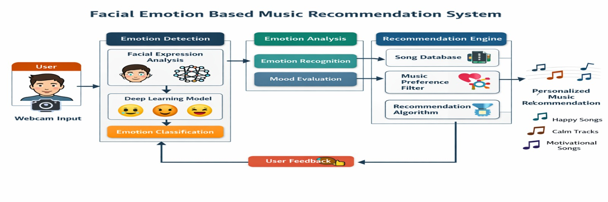

# 🎵 Sentiment Analysis Based Music Recommendation System

A real-time Emotion-Based Music Recommender built using Streamlit, MediaPipe, and Keras.  
The system detects user emotions via webcam using facial and hand landmarks and dynamically recommends songs based on detected mood, language, and artist preference.

---

## 🚀 Features

- 🎭 Real-time Emotion Detection  
- 🎶 Emotion-Based Song Recommendation  
- 📹 Live Video Processing  
- 🧠 Deep Learning Powered  
- 🔄 Session State Management  
- 📊 Confidence-Based Prediction Output  

---

## 🛠 Technologies Used

- **Python 3.11.5**
- **Streamlit** – Web framework
- **streamlit-webrtc** – Real-time Streaming
- **OpenCV** – Computer Vision
- **MediaPipe** – Landmark Detection
- **Keras** – Deep Learning Framework

---

## 📂 Project Structure

```
emotion-music-recommender/
│
├── app.py                      # Main Streamlit application
├── model.h5                    # Trained deep learning model
├── labels.npy                  # Emotion label classes
├── emotion.npy                 # Stores last detected emotion
│
├── requirements.txt            # Project dependencies
├── README.md                   # Project documentation
│
├── assets/
│   └── demo_screenshot.png
│
├── utils/
│   ├── emotion_processor.py    # Emotion detection class
│   └── helpers.py              # Utility functions
│
└── notebooks/
    └── model_training.ipynb    # Model training notebook
```

---

## ⚙️ How It Works

1. User selects language and singer  
2. Webcam activation  
3. Landmark extraction using MediaPipe  
4. Feature Engineering (Landmark coordinates converted into relative positions)  
5. Emotion prediction using trained deep learning model  
6. Song recommendation via YouTube search
   
<p align="center">

</p>
<p align="center">


## ▶️ How to Run the Project

### 1️⃣ Install Dependencies

```bash
pip install -r requirements.txt
```

### 2️⃣ Run the Application

```bash
streamlit run app.py
```

### 3️⃣ Open in Browser

```
http://localhost:8501
```

---

## 🧠 Emotion Classification Model

- **Format:** `model.h5`
- **Framework:** Keras
- **Model Type:** Deep Neural Network (Dense ANN)

### 🔹 Input Features
- Face landmarks (x, y relative offsets)
- Left hand landmarks
- Right hand landmarks

### 🔹 Output
- Emotion class (Happy, Sad, Angry, Neutral, etc.)
- Confidence score

---

## 🎓 Viva Explanation (Short Version)

This project is an Emotion-Based Music Recommendation System built using Streamlit. It captures live webcam video using streamlit-webrtc and detects facial and hand landmarks using MediaPipe. These landmarks are converted into numerical features and passed into a trained deep learning model developed using Keras. The model predicts the user's emotional state such as happy, sad, or angry. Based on the detected emotion, along with user-selected language and singer, the system automatically recommends songs by generating relevant YouTube search results. The objective is to provide personalized music recommendations based on real-time emotional analysis.

---

## ✅ Advantages

- Real-Time Emotion Detection  
- Personalized Music Recommendation  
- Automatic Mood Recognition  
- Lightweight and Fast Model  
- Simple and Interactive Web Interface  

---

## ⚠️ Disclaimer

This project is developed for educational purposes only. Emotion detection accuracy may vary depending on lighting conditions, camera quality, and model performance. Music recommendations are generated via YouTube search results and are not directly affiliated with or endorsed by YouTube.


